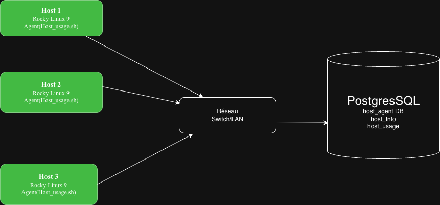

# Linux Cluster Monitoring Agent

## Introduction
The Linux Cluster Monitoring Agent is an infrastructure monitoring solution designed to track and record hardware specifications and real-time resource usage across a Linux cluster. The system automatically collects CPU, memory, and disk metrics from each host and stores them in a centralized PostgreSQL database for analysis and capacity planning. The primary users are system administrators and DevOps engineers who need to monitor server performance and optimize resource allocation across multiple Linux nodes. The project was built using Bash scripting for data collection, PostgreSQL for persistent data storage, Docker for database containerization, Git for version control, and crontab for automated task scheduling. This lightweight solution provides continuous monitoring without requiring heavy third-party tools.

## Quick Start

### 1. Start a psql instance using psql_docker.sh
```bash
bash scripts/psql_docker.sh start postgres password
```

### 2. Create tables using ddl.sql
```bash
psql -h localhost -p 5432 -U postgres -d host_agent -f sql/ddl.sql
```

### 3. Insert hardware specs data into the DB using host_info.sh
```bash
bash scripts/host_info.sh localhost 5432 host_agent postgres password
```

### 4. Insert hardware usage data into the DB using host_usage.sh
```bash
bash scripts/host_usage.sh localhost 5432 host_agent postgres password
```

### 5. Crontab setup
```bash
# Open crontab editor
crontab -e

# Add this line to collect usage data every minute
* * * * * bash /home/rocky/dev/jarvis_data_eng_IvanNgoudjo/linux_sql/scripts/host_usage.sh localhost 5432 host_agent postgres password > /tmp/host_usage.log

# Verify crontab is set
crontab -l
```

## Implementation
The project is implemented using two Bash scripts that collect hardware and resource usage data from Linux hosts. The data is inserted into a PostgreSQL database running inside a Docker container. The host_info.sh script runs once at installation to register the host hardware specifications. The host_usage.sh script runs every minute via crontab to continuously collect real-time metrics such as CPU usage, memory, and disk availability.

### Architecture
The cluster consists of three Linux hosts, each running a monitoring agent. All agents send data to a centralized PostgreSQL database. For a visual representation of the architecture, please refer to the cluster diagram in the `assets` directory.


### Scripts

#### psql_docker.sh
Manages the PostgreSQL Docker container. Supports start, stop, and create operations.
```bash
bash scripts/psql_docker.sh start|stop|create [db_username] [db_password]

# Example
bash scripts/psql_docker.sh start postgres password
```

#### host_info.sh
Collects hardware specifications (CPU, memory, architecture) and inserts them into the host_info table. This script runs only once when a new host is added to the cluster.
```bash
bash scripts/host_info.sh psql_host psql_port db_name psql_user psql_password

# Example
bash scripts/host_info.sh localhost 5432 host_agent postgres password
```

#### host_usage.sh
Collects real-time resource usage (CPU idle, memory free, disk available) and inserts the data into the host_usage table. Runs every minute via crontab.
```bash
bash scripts/host_usage.sh psql_host psql_port db_name psql_user psql_password

# Example
bash scripts/host_usage.sh localhost 5432 host_agent postgres password
```

#### crontab
Automates the execution of host_usage.sh every minute to continuously monitor the cluster.
```bash
* * * * * bash /home/rocky/dev/jarvis_data_eng_IvanNgoudjo/linux_sql/scripts/host_usage.sh localhost 5432 host_agent postgres password > /tmp/host_usage.log
```

#### queries.sql
Contains business queries to help administrators make data-driven decisions about the cluster infrastructure:
- Identify hosts with low available memory to prevent performance degradation
- Detect hosts with abnormally high CPU usage to balance workloads
- Monitor disk usage trends to plan storage capacity upgrades before running out of space

## Database Modeling

### `host_info`
| Column | Type | Description |
|---|---|---|
| id | SERIAL | Auto-incremented primary key |
| hostname | VARCHAR | Fully qualified hostname of the host |
| cpu_number | INT2 | Number of logical CPUs |
| cpu_architecture | VARCHAR | CPU architecture (e.g. x86_64) |
| cpu_model | VARCHAR | Full CPU model name |
| cpu_mhz | FLOAT8 | CPU clock speed in MHz |
| l2_cache | INT4 | L2 cache size in kB |
| total_mem | INT4 | Total memory in kB |
| timestamp | TIMESTAMP | Date and time of data collection in UTC |

### `host_usage`
| Column | Type | Description |
|---|---|---|
| timestamp | TIMESTAMP | Date and time of data collection in UTC |
| host_id | INT4 | Foreign key referencing host_info.id |
| memory_free | INT4 | Available free memory in MB |
| cpu_idle | INT2 | Percentage of CPU idle time |
| cpu_kernel | INT2 | Percentage of CPU used by kernel |
| disk_io | INT4 | Number of disk I/O operations |
| disk_available | INT4 | Available disk space on root partition in MB |

## Test
The bash scripts and DDL were tested manually by executing each script individually and verifying the output directly in the PostgreSQL database using SELECT queries. The host_info.sh script was validated by confirming that all hardware specifications were correctly parsed and inserted into the host_info table with no missing or empty fields. The host_usage.sh script was tested by running it multiple times and verifying that new rows were added with accurate timestamps and resource metrics. The crontab automation was validated by waiting several minutes and confirming that new rows appeared in the host_usage table at one-minute intervals. All tests returned the expected result of INSERT 0 1 confirming successful insertions.

## Deployment
The application was deployed using the following tools and services:
- **GitHub**: Source code is version controlled and hosted on GitHub using the GitFlow branching strategy with feature branches and pull requests
- **Docker**: The PostgreSQL database is containerized using Docker with a persistent volume to ensure data is not lost when the container is restarted or removed
- **Crontab**: The host_usage.sh script is automated using Linux crontab to collect resource metrics every minute without manual intervention

## Improvements
- Handle hardware updates automatically: currently host_info.sh runs only once at installation, so if the hardware configuration changes the database will not reflect the update
- Add alerting functionality to send email or Slack notifications when CPU usage or memory usage exceeds a critical threshold
- Extend the monitoring solution to track network bandwidth consumption and packet loss across all hosts in the cluster
