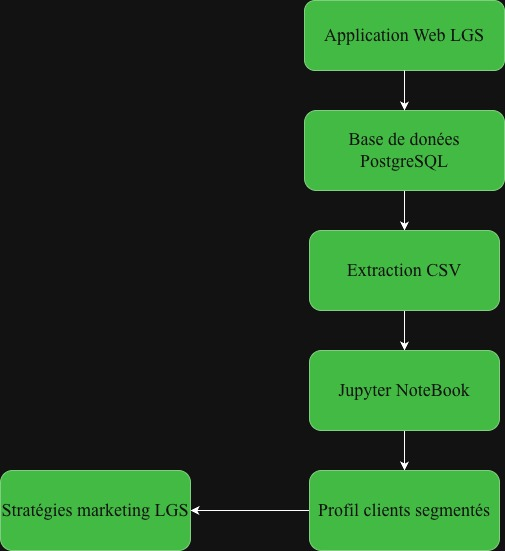

# Analyse et Segmentation de Données Clients (RFM) - LGS

## Introduction

### Contexte Commercial
Dans le secteur du commerce de détail, la profusion de données transactionnelles brute représente une mine d'or sous-exploitée. Pour notre client LGS, une plateforme de retail en pleine croissance, le défi principal réside dans l'incapacité à identifier précisément la valeur et le comportement de sa base de clients. Sans une vue segmentée, les campagnes marketing et les efforts de rétention restent génériques, entraînant une hausse des coûts d'acquisition et un manque à gagner sur la valeur à vie du client (Customer Lifetime Value). Ce projet vise à transformer ces transactions brutes en indicateurs stratégiques exploitables.

### Utilisation des Résultats par LGS
Les équipes marketing et de direction de LGS utiliseront les résultats de cette analyse pour orchestrer des stratégies de croissance ciblées :
* **Optimisation des campagnes marketing :** Concevoir des offres personnalisées selon le segment (ex: incitatifs exclusifs pour les "Champions", campagnes de réactivation pour les clients "À risque").
* **Allocation budgétaire efficace :** Concentrer les ressources de rétention sur les segments à forte valeur monétaire.
* **Réduction du taux de désabonnement (Churn) :** Anticiper le départ des clients dont la récence augmente anormalement afin de déclencher des alertes automatiques.

### Technologies et Approche Technique
Le projet repose sur un pipeline complet de traitement de données (Data Wrangling) et d'analyse exploratoire, matérialisé par les technologies suivantes :
* **Langage & Environnement :** Python 3 (exécuté au sein d'un environnement virtuel `.venv`) et Jupyter Notebook pour l'expérimentation.
* **Bibliothèques de Données :** `Pandas` et `NumPy` pour le nettoyage, la gestion des types (dates, identifiants) et l'ingénierie des caractéristiques (feature engineering).
* **Visualisation :** `Matplotlib` et `Seaborn` pour analyser la distribution des métriques.
* **Stockage & Stock de Données :** Gestion des volumes transactionnels via PostgreSQL pour l'extraction initiale des données massives.

---

## Implémentation

### Architecture du Projet

L'écosystème analytique s'intègre directement avec la plateforme web de LGS selon l'architecture logique suivante :

1. **Production (Web App LGS) :** Les utilisateurs passent des commandes sur l'application Web LGS, générant des transactions en temps réel stockées dans la base de données de production.
2. **Entrepôt de Données / Extraction :** Afin d'éviter de ralentir l'application web LGS en production avec des requêtes analytiques lourdes, les données sont isolées. Les journaux de transactions historiques sont compilés dans un format structuré (tel que le fichier `online_retail_II.csv`) et transférés vers notre environnement d'ingénierie dédié.
3. **Pipeline de Transformation (Notebook) :** Nettoyage des données (exclusion des montants négatifs/annulations), agrégation par client (`invoice_no`), et calcul des scores RFM (Récence, Fréquence, Montant).
4. **Modélisation & Restitution :** Segmentation des clients pour alimenter le tableau de bord décisionnel de LGS.

#### Diagramme d'architecture

please refer to architectural diagram in the `assets` directory.

## Analyse et manipulation des données

* **Lien vers le code source :** L'ensemble des étapes d'ingénierie, de nettoyage des données et de calculs statistiques est consultable directement dans le [Jupyter Notebook pour l'analyse et la manipulation des données](/python_data_wrangling/customer-segmentation-with-rfm-score.ipynb).

### Stratégie de données commerciales : Générer des revenus pour LGS

Les données transactionnelles brutes indiquent seulement *ce qui s'est passé*, mais l'analyse RFM révèle *qui cibler*. Afin de transformer ces informations analytiques en retours financiers directs pour LGS, j'ai conçu une stratégie marketing axée sur les données et basée sur le comportement des clients.

Au lieu de déployer des campagnes génériques coûteuses et peu rentables, LGS peut segmenter son audience pour maximiser la conversion et augmenter le panier moyen :

1. **Maximiser la valeur vie client VIP (Champions et clients fidèles) :**

* **Les données :** Ces clients achètent fréquemment et représentent la contribution financière la plus importante.

* **L?action :** LGS devrait éviter de gaspiller des coupons de réduction sur ce groupe, car ces clients sont déjà disposés à acheter. Mettez plutôt en place un programme de fidélité VIP exclusif, offrez un accès anticipé aux nouveaux produits et déployez un système de parrainage pour acquérir des profils similaires à forte valeur ajoutée.

2. **Fidélisation (Nouveaux clients et clients récents) :**

* **Données :** Score de récence élevé, mais faible fréquence d'achat. Ils viennent de découvrir LGS.

* **Action :** Créez une séquence d'e-mails de bienvenue automatisée. Par exemple, envoyez un e-mail de remerciement 48 heures après leur premier achat, avec une réduction de 15 % valable seulement 10 jours. Jouez sur l'urgence pour générer une deuxième commande et instaurer une habitude d'achat durable.

3. **Prévenir l'attrition (Clients à risque et sur le point d'abandonner) :**

* **Données :** Ils dépensaient beaucoup et achetaient souvent, mais leur score de récence a chuté de manière significative (ils ne sont pas revenus depuis des mois).

* **Action :** Déployez des campagnes de reconquête dynamiques et attractives. Automatisez l'envoi d'e-mails personnalisés avec des objets tels que : « [Nom], vous nous manquez ! Voici un crédit dynamique de 20 $ sur votre prochaine commande. » Reconquérir un client fidèle et dépensier coûte cinq fois moins cher que d'en acquérir un nouveau.

---

## Améliorations

Si je disposais de davantage de temps de développement et de ressources d'ingénierie, j'apporterais les trois améliorations architecturales suivantes à ce projet :

1. **Automatisation et orchestration du pipeline de production :**

Transition du code analytique, actuellement développé dans un environnement interactif Jupyter Notebook, vers des scripts Python modulaires (.py) prêts pour la production. J'orchestrerais ces scripts à l'aide d'un outil de workflow comme **Apache Airflow** ou **Prefect** afin d'automatiser l'extraction, le nettoyage et le calcul du score RFM selon une planification cron quotidienne.

2. **Regroupement avancé des clients par apprentissage automatique :**

Au lieu d'utiliser des quartiles manuels et rigides pour définir les segments clients, j'implémenterais un algorithme d'apprentissage automatique non supervisé tel que le **K-Means Clustering** (avec `scikit-learn`). En appliquant la méthode du coude pour déterminer le nombre optimal de clusters, LGS pourrait découvrir des sous-segments comportementaux cachés, échappant aux règles manuelles.

3. **Mise à l'échelle du Big Data avec PySpark et Delta Lake :**

L'implémentation Pandas actuelle traite les données en mémoire, ce qui risque de créer un goulot d'étranglement à mesure que LGS se développera. Je propose de repenser les fonctions de manipulation des données en utilisant les dataframes **PySpark** et de stocker les enregistrements traités dans un **Delta Lake** sur **Databricks**. Cette approche garantit une mise à l'échelle aisée de l'architecture pour gérer des centaines de millions de transactions internationales, tout en respectant les propriétés ACID.
